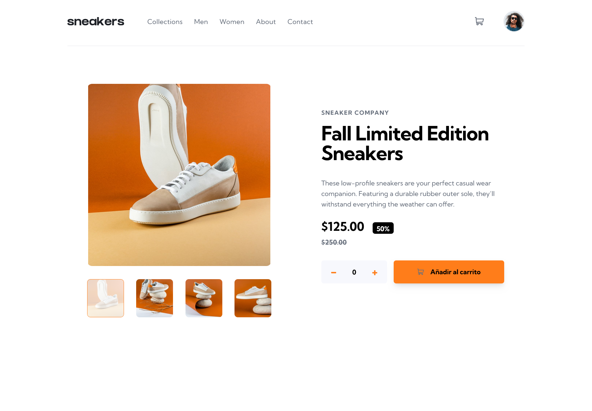

# Frontend Mentor - E-commerce product page solution

This is a solution to the [E-commerce product page challenge on Frontend Mentor](https://www.frontendmentor.io/challenges/ecommerce-product-page-UPsZ9MJp6).

## Table of contents

- [Overview](#overview)
  - [The challenge](#the-challenge)
  - [Screenshot](#screenshot)
  - [Links](#links)
  - [Built with](#built-with)
- [Author](#author)

## Overview

### The challenge

Users should be able to:

- View the optimal layout for the site depending on their device's screen size
- See hover states for all interactive elements on the page
- Open a lightbox gallery by clicking on the large product image
- Switch the large product image by clicking on the small thumbnail images
- Add items to the cart
- View the cart and remove items from it

### Screenshot

### Links

- Solution URL: [Github](https://github.com/uvdevelop26/ecomerce-product-page.git)
- Live Site URL: [Netlify](https://ecommerceproductviewer.netlify.app/)

### Built with

- Semantic HTML5 markup
- [TailwindCSS](https://tailwindcss.com/) - CSS Framework
- Flexbox
- Mobile-first workflow
- [Vue.js](https://es.vuejs.org/v2/guide/) - JS library

## Author

- Instagram - [UVbusiness](https://www.instagram.com/uvbusiness24/)
- Frontend Mentor - [@uvdevelop26](https://www.frontendmentor.io/profile/uvdevelop26)